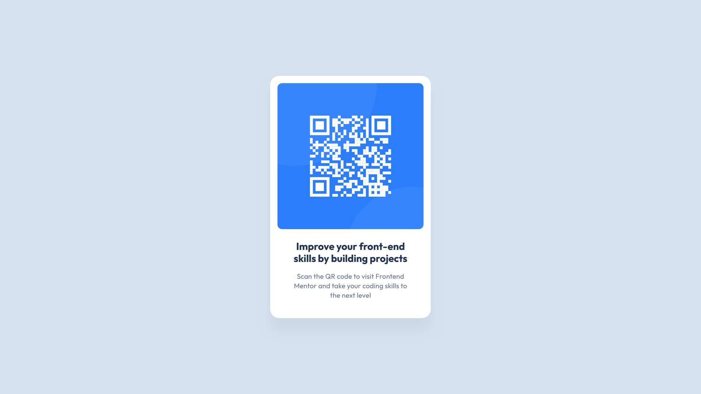

# Frontend Mentor - QR code component solution

This is a solution to the [QR code component challenge on Frontend Mentor](https://www.frontendmentor.io/challenges/qr-code-component-iux_sIO_H). Frontend Mentor challenges help you improve your coding skills by building realistic projects.

## Table of contents

- [Overview](#overview)
- [Screenshot](#screenshot)
- [Links](#links)
- [Built with](#built-with)
- [Author](#author)

## Overview

### Screenshot

### Links

- Solution URL: [https://www.frontendmentor.io/solutions/qr-code-component-DzLFM_p71g](https://www.frontendmentor.io/solutions/qr-code-component-DzLFM_p71g)
- Live Site URL: [https://qr-code-challenge-omega.vercel.app/](https://qr-code-challenge-omega.vercel.app/)

## My process

### Built with

- HTML5 markup
- CSS variables
- Flexbox
- Mobile-first workflow
- Comments after every line - Readability
- [BEM](https://getbem.com/) - Front-end component methodology

## Author

[Front-End Mentor](https://www.frontendmentor.io/profile/RighteousHundred) Account

[GitHub](https://github.com/RighteousHundred) Account

[YouTube](https://youtube.com/@evanwebdev) Channel
